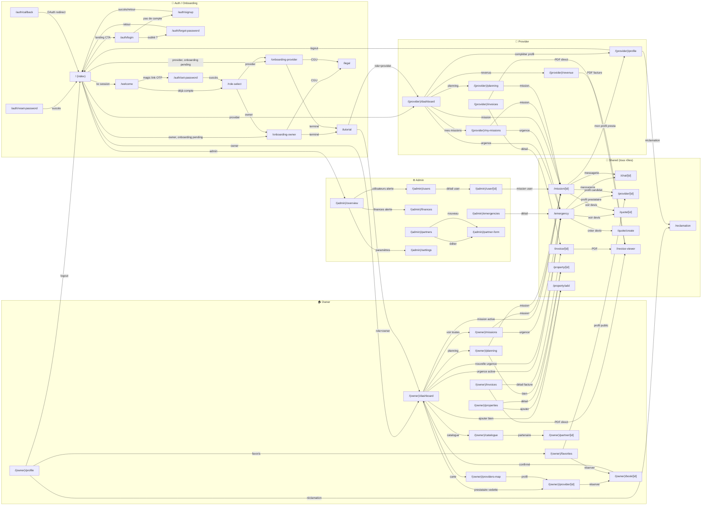

# ARCHITECTURE — Altio Frontend

> Généré automatiquement à partir du code source. Ne pas modifier manuellement.

---

## SECTION 2 — Flux de navigation

```mermaid
flowchart LR

  subgraph auth["🔐 Auth / Onboarding"]
    IDX["/ (index)"]
    WELCOME["/welcome"]
    LOGIN["/auth/login"]
    SIGNUP["/auth/signup"]
    FORGOT["/auth/forgot-password"]
    RESET["/auth/reset-password"]
    SETPWD["/auth/set-password"]
    CALLBACK["/auth/callback"]
    ROLESEL["/role-select"]
    ONBOWNER["/onboarding-owner"]
    ONBPROV["/onboarding-provider"]
    TUTORIAL["/tutorial"]
    LEGAL["/legal"]
  end

  subgraph shared["🔀 Shared (tous rôles)"]
    EMERGENCY["/emergency"]
    MISSION_ID["/mission/[id]"]
    CHAT_ID["/chat/[id]"]
    PROVIDER_ID["/provider/[id]"]
    QUOTE_ID["/quote/[id]"]
    QUOTE_CREATE["/quote/create"]
    INVOICE_ID["/invoice/[id]"]
    INVOICE_VIEWER["/invoice-viewer"]
    PROPERTY_ID["/property/[id]"]
    PROPERTY_ADD["/property/add"]
    RECLAMATION["/reclamation"]
  end

  subgraph owner["🏠 Owner"]
    OWN_DASH["/(owner)/dashboard"]
    OWN_MISSIONS["/(owner)/missions"]
    OWN_PROPERTIES["/(owner)/properties"]
    OWN_PROFILE["/(owner)/profile"]
    OWN_PLANNING["/(owner)/planning"]
    OWN_MAP["/(owner)/providers-map"]
    OWN_PROVIDER_ID["/(owner)/provider/[id]"]
    OWN_BOOK_ID["/(owner)/book/[id]"]
    OWN_CATALOGUE["/(owner)/catalogue"]
    OWN_PARTNER_ID["/(owner)/partner/[id]"]
    OWN_FAVORITES["/(owner)/favorites"]
    OWN_INVOICES["/(owner)/invoices"]
  end

  subgraph provider["🔧 Provider"]
    PRV_DASH["/(provider)/dashboard"]
    PRV_MYMISSIONS["/(provider)/my-missions"]
    PRV_PLANNING["/(provider)/planning"]
    PRV_PROFILE["/(provider)/profile"]
    PRV_REVENUE["/(provider)/revenue"]
    PRV_INVOICES["/(provider)/invoices"]
  end

  subgraph admin["⚙️ Admin"]
    ADM_OVERVIEW["/(admin)/overview"]
    ADM_USERS["/(admin)/users"]
    ADM_USER_ID["/(admin)/user/[id]"]
    ADM_EMERGENCIES["/(admin)/emergencies"]
    ADM_FINANCES["/(admin)/finances"]
    ADM_PARTNERS["/(admin)/partners"]
    ADM_PARTNER_FORM["/(admin)/partner-form"]
    ADM_SETTINGS["/(admin)/settings"]
  end

  %% ── POINT D'ENTRÉE ──────────────────────────────────────────────
  IDX -->|"no session"| WELCOME
  IDX -->|"owner, onboarding pending"| ONBOWNER
  IDX -->|"provider, onboarding pending"| ONBPROV
  IDX -->|"admin"| ADM_OVERVIEW
  IDX -->|"owner"| OWN_DASH
  IDX -->|"provider"| PRV_DASH
  IDX -->|"landing CTA"| LOGIN

  %% ── AUTH ────────────────────────────────────────────────────────
  WELCOME -->|"magic link OTP"| SETPWD
  WELCOME -->|"déjà compte"| ROLESEL
  LOGIN -->|"oublié ?"| FORGOT
  LOGIN -->|"pas de compte"| SIGNUP
  SIGNUP -->|"succès/retour"| IDX
  FORGOT -->|"retour"| IDX
  RESET -->|"succès"| IDX
  SETPWD -->|"succès"| ROLESEL
  CALLBACK -->|"OAuth redirect"| IDX

  %% ── ONBOARDING ──────────────────────────────────────────────────
  ROLESEL -->|"owner"| ONBOWNER
  ROLESEL -->|"provider"| ONBPROV
  ONBOWNER -->|"CGU"| LEGAL
  ONBOWNER -->|"terminé"| TUTORIAL
  ONBPROV -->|"CGU"| LEGAL
  ONBPROV -->|"terminé"| TUTORIAL
  TUTORIAL -->|"role=owner"| OWN_DASH
  TUTORIAL -->|"role=provider"| PRV_DASH

  %% ── OWNER ───────────────────────────────────────────────────────
  OWN_DASH -->|"urgence active"| EMERGENCY
  OWN_DASH -->|"mission active"| MISSION_ID
  OWN_DASH -->|"voir toutes"| OWN_MISSIONS
  OWN_DASH -->|"planning"| OWN_PLANNING
  OWN_DASH -->|"catalogue"| OWN_CATALOGUE
  OWN_DASH -->|"carte"| OWN_MAP
  OWN_DASH -->|"prestataire vedette"| OWN_PROVIDER_ID
  OWN_DASH -->|"ajouter bien"| PROPERTY_ADD
  OWN_DASH -->|"nouvelle urgence"| EMERGENCY

  OWN_MISSIONS -->|"urgence"| EMERGENCY
  OWN_MISSIONS -->|"mission"| MISSION_ID

  OWN_PROPERTIES -->|"ajouter"| PROPERTY_ADD
  OWN_PROPERTIES -->|"détail"| PROPERTY_ID

  OWN_PLANNING -->|"mission"| MISSION_ID
  OWN_PLANNING -->|"bien"| PROPERTY_ID

  OWN_MAP -->|"profil"| OWN_PROVIDER_ID
  OWN_PROVIDER_ID -->|"réserver"| OWN_BOOK_ID
  OWN_BOOK_ID -->|"confirmé"| OWN_DASH

  OWN_CATALOGUE -->|"partenaire"| OWN_PARTNER_ID

  OWN_FAVORITES -->|"profil public"| PROVIDER_ID
  OWN_FAVORITES -->|"réserver"| OWN_BOOK_ID

  OWN_INVOICES -->|"détail facture"| INVOICE_ID
  OWN_INVOICES -->|"PDF direct"| INVOICE_VIEWER

  OWN_PROFILE -->|"logout"| IDX
  OWN_PROFILE -->|"favoris"| OWN_FAVORITES
  OWN_PROFILE -->|"réclamation"| RECLAMATION

  %% ── PROVIDER ────────────────────────────────────────────────────
  PRV_DASH -->|"urgence"| EMERGENCY
  PRV_DASH -->|"mission"| MISSION_ID
  PRV_DASH -->|"compléter profil"| PRV_PROFILE
  PRV_DASH -->|"revenus"| PRV_REVENUE
  PRV_DASH -->|"planning"| PRV_PLANNING
  PRV_DASH -->|"mes missions"| PRV_MYMISSIONS

  PRV_MYMISSIONS -->|"mission"| MISSION_ID
  PRV_MYMISSIONS -->|"urgence"| EMERGENCY

  PRV_PLANNING -->|"mission"| MISSION_ID

  PRV_PROFILE -->|"logout"| IDX
  PRV_PROFILE -->|"réclamation"| RECLAMATION

  PRV_REVENUE -->|"PDF facture"| INVOICE_VIEWER

  PRV_INVOICES -->|"détail"| INVOICE_ID
  PRV_INVOICES -->|"PDF direct"| INVOICE_VIEWER

  %% ── SHARED ──────────────────────────────────────────────────────
  EMERGENCY -->|"créer devis"| QUOTE_CREATE
  EMERGENCY -->|"messagerie"| CHAT_ID
  EMERGENCY -->|"profil prestataire"| PROVIDER_ID
  EMERGENCY -->|"voir devis"| QUOTE_ID

  MISSION_ID -->|"voir devis"| QUOTE_ID
  MISSION_ID -->|"messagerie"| CHAT_ID
  MISSION_ID -->|"profil candidat"| PROVIDER_ID
  MISSION_ID -->|"mon profil presta"| PRV_PROFILE

  INVOICE_ID -->|"PDF"| INVOICE_VIEWER

  %% ── ADMIN ───────────────────────────────────────────────────────
  ADM_OVERVIEW -->|"paramètres"| ADM_SETTINGS
  ADM_OVERVIEW -->|"finances alerte"| ADM_FINANCES
  ADM_OVERVIEW -->|"utilisateurs alerte"| ADM_USERS
  ADM_USERS -->|"détail user"| ADM_USER_ID
  ADM_USER_ID -->|"mission user"| MISSION_ID
  ADM_PARTNERS -->|"éditer"| ADM_PARTNER_FORM
  ADM_PARTNERS -->|"nouveau"| ADM_PARTNER_FORM
  ADM_EMERGENCIES -->|"détail"| EMERGENCY
```
